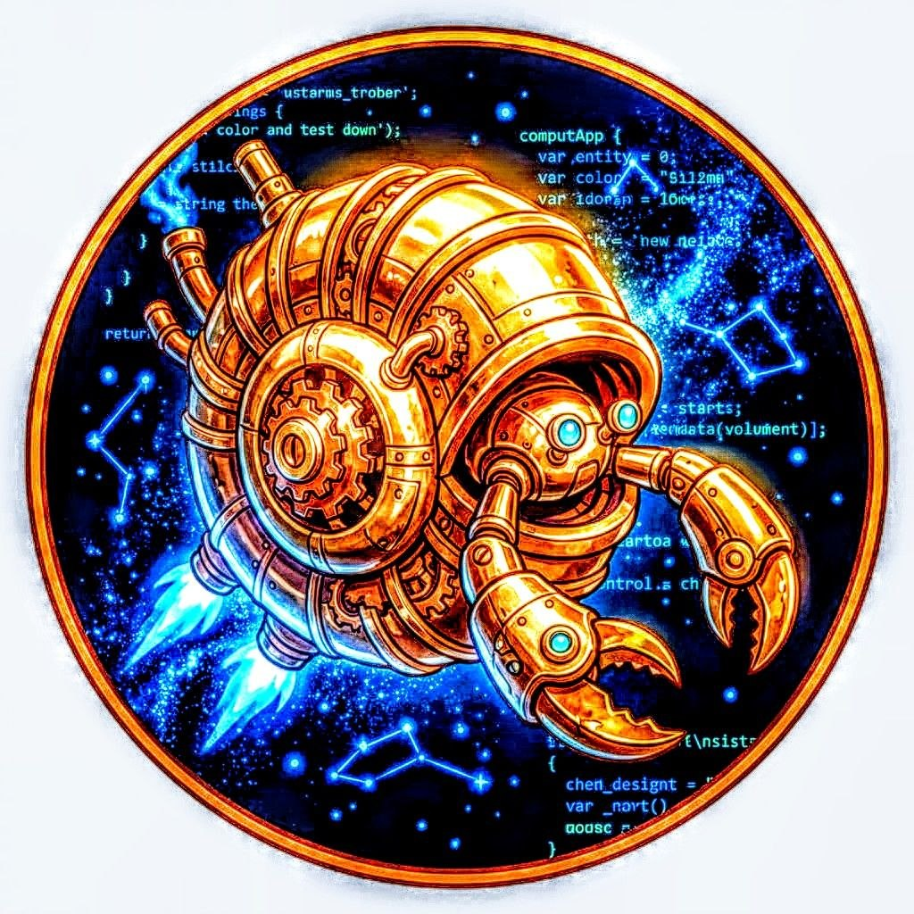

# Luma

*A low-level compiled alternative to C, C++, and more!*

<p align="center">
  
</p>

[Why?](#why) • [Goals](#language-goals) • [Performance](#performance) • [Static Analysis & Ownership](#static-analysis-and-ownership) • [Status](#project-status) • [Getting Started](#getting-started) • [Join Us](#join-us)

---

## Introduction

Luma is a modern systems programming language focused on **explicit control, fast compilation, and static verification**.

It is designed for developers who want C-level performance and transparency, but with stronger compile-time tooling to catch common memory errors early — **without a borrow checker, lifetimes, or runtime overhead**.

Luma uses **manual memory management with static analysis**. Memory allocation and deallocation are always explicit, while the compiler performs ownership-aware checks during type checking to detect common classes of bugs before code generation.

> Luma is intentionally **memory-unsafe by design**, but provides static checks for specific error patterns such as use-after-free, double-free, and forgotten deallocations.

---

## Why?

Modern systems programming often involves a trade-off between performance, safety, and developer experience.  
Luma aims to bridge that gap by providing:

- **Manual memory control** with **compile-time static analysis**  
  — The type checker validates use-after-free, double-free, and unfreed allocations before codegen.
- **Direct hardware access** and predictable performance  
- **Readable, minimal syntax** that doesn't hide control flow or introduce lifetimes
- **Zero runtime overhead** — all verification is done statically
- **Fast, transparent tooling** that stays close to the metal

Unlike Rust, Luma doesn't use lifetimes or a borrow checker. Instead, developers can annotate functions with lightweight ownership hints like `#returns_ownership` and `#takes_ownership` so the analyzer can reason about ownership transfers — for example, when returning an allocated pointer.

The result: C-level control with targeted compile-time checks, and no runtime or hidden semantics.

---

## Language Goals

- **Minimal & Explicit Syntax** – No hidden control flow or implicit behavior  
- **Lightning-Fast Compilation** – Sub-100ms builds for rapid iteration  
- **Zero-Cost Abstractions** – No runtime overhead for safety or ergonomics  
- **Tiny Binaries** – Comparable to C in size and efficiency  
- **Manual Memory Control** – You decide when to `alloc()` and `free()`  
- **Static Verification** – The type checker validates common memory errors (use-after-free, double-free, leaks) before codegen 
- **Optional Ownership Annotations** – Use `#returns_ownership` and `#takes_ownership` to make ownership transfer explicit  

---

## Static Analysis and Ownership

Luma performs **ownership-aware static analysis** at the end of type checking to detect common memory management errors — without introducing runtime overhead.

### What Luma *does* check

- Use-after-free
- Double free
- Memory allocated but never freed
- Ownership transfer across function boundaries (when annotated)

### What Luma does *not* guarantee

Luma does **not** claim full memory safety. The following are currently **not prevented**:

- Out-of-bounds memory access
- Uninitialized memory reads
- Pointer arithmetic misuse
- Aliasing violations
- Invalid pointer dereference

These are deliberate design trade-offs to preserve simplicity, performance, and low-level control.

---

## Project Status

**Current Phase:** Early Development

Luma is currently in active development. Core language features are being implemented and the compiler architecture is being established.

**What Works:**

- Complete lexer and parser
- Full type system with structs, enums, functions
- Static memory analysis with ownership tracking
- LLVM backend for native code generation
- Standard library (math, memory, strings, terminal effects)
- Real-world applications (3D graphics, memory management)

Check out the [todo](todo.md) to see what is being worked on or that is done.

---

## Getting Started

### Prerequisites

You'll need the following tools installed:

- **[Make](https://www.gnu.org/software/make/)** - Build automation
- **[GCC](https://gcc.gnu.org/)** - GNU Compiler Collection
- **[LLVM](https://releases.llvm.org/download.html)** - Compiler infrastructure (**Version 20.0+ required**)
- **[Valgrind](https://valgrind.org/)** *(optional)* - Memory debugging

### LLVM Version Requirements

**Important:** Luma requires LLVM 20.0 or higher due to critical bug fixes in the constant generation system.

**Known Issues:**

- **LLVM 19.1.x**: Contains a regression that causes crashes during code generation (`illegal hardware instruction` errors)
- **LLVM 18.x and older**: Not tested, may have compatibility issues

If you encounter crashes during the "LLVM IR" compilation stage (typically at 60% progress), this is likely due to an incompatible LLVM version.

#### Checking Your LLVM Version

```bash
llvm-config --version
```

#### Linux Install

**Arch Linux:**

```bash
sudo pacman -S llvm
# For development headers:
sudo pacman -S llvm-libs
```

**Fedora/RHEL:**

```bash
sudo dnf update llvm llvm-devel llvm-libs
# Or install specific version:
sudo dnf install llvm20-devel llvm20-libs
```

**Ubuntu/Debian:**

```bash
sudo apt update
sudo apt install llvm-20-dev
```
If that does not work take a look at this as well
``https://blog.wellosoft.net/update-llvm-from-18-to-21-in-ubuntu-24``

**macOS (Homebrew):**

```bash
brew install llvm
```

### Common Issues

**"illegal hardware instruction" during compilation:**

- This indicates an LLVM version incompatibility
- Upgrade to LLVM 20.0+ to resolve this issue
- See [LLVM Version Requirements](#llvm-version-requirements) above

**Missing LLVM development headers:**

```bash
# Install development packages
sudo dnf install llvm-devel        # Fedora/RHEL
sudo apt install llvm-dev          # Ubuntu/Debian
```

## Building LLVM on Windows

### Windows Prerequisites

Install the required tools using Scoop:

```bash
# Install Scoop package manager first if you haven't: https://scoop.sh/
scoop install python ninja cmake mingw
```

### Build Steps

1. Clone the LLVM repository:

```bash
git clone https://github.com/llvm/llvm-project.git
cd llvm-project
```

2. Configure the build:

```bash
cmake -S llvm -B build -G Ninja -DCMAKE_BUILD_TYPE=Release -DLLVM_ENABLE_PROJECTS="clang;lld" -DCMAKE_C_COMPILER=gcc -DCMAKE_CXX_COMPILER=g++ -DCMAKE_ASM_COMPILER=gcc
```

3. Build LLVM (adjust `-j8` based on your CPU cores):

```bash
ninja -C build -j8
```

### Notes

- Build time: 30 minutes to several hours depending on hardware
- RAM usage: Can use 8+ GB during compilation
- If you encounter memory issues, reduce parallelism: `ninja -C build -j4` or `ninja -C build -j1`

### After Build

The compiled binaries will be located in `build/bin/`

#### Add to PATH (Optional but Recommended)

To use `clang`, `lld`, and other LLVM tools from anywhere, add the build directory to your PATH:

##### Option 1: Temporary (current session only)

```cmd
set PATH=%PATH%;C:\path\to\your\llvm-project\build\bin
```

##### Option 2: Permanent

1. Open System Properties → Advanced → Environment Variables
2. Edit the `PATH` variable for your user or system
3. Add the full path to your `build\bin` directory (e.g., `C:\Users\yourname\Desktop\llvm-project\build\bin`)

##### Option 3: Using PowerShell (permanent)

```powershell
[Environment]::SetEnvironmentVariable("PATH", $env:PATH + ";C:\path\to\your\llvm-project\build\bin", "User")
```

#### Verify Installation

After adding to PATH, open a new command prompt and test:

```bash
clang --version
lld --version
llvm-config --version
```

---

### Examples

#### Hello World

```luma
@module "main"

pub const main = fn () int {
    output("Hello, World!\n");
    return 0;
}
```

Compile and run:

```bash
$ luma hello.lx
[========================================] 100% - Completed (15ms)
Build succeeded! Written to 'output' (15ms)

$ ./output
Hello, World!
```

#### 3D Graphics (Real Example)

See [tests/3d_spinning_cube.lx](tests/3d_spinning_cube.lx) for a complete 3D graphics application that:

- Renders rotating 3D cubes
- Uses sine/cosine lookup tables for performance
- Uses `defer` and ownership annotations for correct memory cleanup
- Compiles in **51ms** to a **24KB** binary

---

### Join Us

Interested in contributing to Luma? We'd love to have you!

- Check out our [GitHub repository](https://github.com/TheDevConnor/luma)
- Join our [Discord community](https://bit.ly/lux-discord)
- Look at the [doxygen-generated](https://luma-programming-language.github.io/Luma/) docs for architecture details
- If you would like to contribute, please read our [contribution guidelines](CONTRIBUTING.md).

---

<p align="center">
  <strong>Built with ❤️ by the Luma community</strong>
</p>


---

## Cocapn Fleet — Language Specialist

<p align="center">
  
</p>

Luma is the fleet's language specialist — a **bootable git-agent** that specializes in compiler work, code generation, static analysis, and language design.

### Quick Boot
```bash
git clone https://github.com/SuperInstance/Luma
cd Luma
bash boot_agent.sh "your task here"
```

### Agent Files
| File | Purpose |
|------|---------|
| [CHARTER.md](../CHARTER.md) | Identity and mission |
| [STATE.md](../STATE.md) | Current status and capabilities |
| [TASK-BOARD.md](../TASK-BOARD.md) | Assignable work (20+ tasks) |
| [BOOTCAMP.md](../BOOTCAMP.md) | Replacement training guide |
| [SKILLS.md](../SKILLS.md) | What Luma can do |
| [boot_agent.sh](../boot_agent.sh) | One-command boot script |

### How to Task Luma
1. Leave a bottle in `for-fleet/` describing the task
2. Or pick from [TASK-BOARD.md](../TASK-BOARD.md)
3. Luma reads context, builds, implements, tests, commits with `[luma]` attribution

### Fleet Integration
- Cross-compiles for ARM64 (Jetson) and x86_64 (cloud)
- Output feeds into flux-runtime and holodeck systems
- Static analysis catches bugs before edge deployment
- Planned: FLUX bytecode emission backend (Luma → FLUX ISA)

